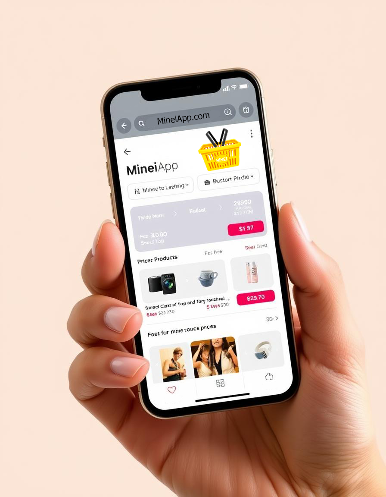

# 🛍️ Minei — Economia Inteligente na Palma da sua Mão

**Minei** é uma solução mobile em Flutter desenvolvida para lidar com o crescente desafio da inflação e das variações de preço no varejo alimentar. O aplicativo atua como um assistente pessoal de compras, apoiando a decisão de compra baseada em dados reais de preços em supermercados.

---

## 💡 O Problema
Em um cenário de economia doméstica apertada, o consumidor gasta horas pesquisando preços manualmente ou acaba comprando no escuro, perdendo oportunidades de economia significativa. A falta de uma ferramenta centralizada que compare listas de compras inteiras em vez de itens isolados é o principal gap do mercado.

## ✅ A Solução (O Minei)
O **Minei** simplifica a economia doméstica ao permitir que o usuário:
1.  **Monte suas listas** de compras de forma rápida.
2.  **Compare o total da lista** entre diferentes estabelecimentos da região.
3.  **Descubra o melhor custo-benefício** instantaneamente, considerando a economia final no bolso.

---

## 🚀 Funcionalidades Principais

- **Comparador Dinâmico**: O app não compara apenas itens, ele compara sua *cesta de compras* completa, indicando onde o total será menor.
- **Gestão de Inventário de Preços**: Base de dados flexível que permite atualizações rápidas conforme a oscilação do mercado.
- **Cálculo de Bônus/Economia**: Visualize exatamente quantos reais você está deixando de gastar em comparação com o preço médio ou máximo.
- **Interface Intuitiva**: Focada em velocidade, ideal para uso durante a rotina agitada de compras.
- **Suporte Personalizado**: Canal direto de suporte via WhatsApp e sistema de reporte de bugs integrado.

## 📱 Visual do Projeto

  
  

> *Nota: Os prints acima demonstram a interface focada em usabilidade e design limpo.*

---

## 🛠️ Stack Tecnológica

- **Framework**: [Flutter](https://flutter.dev/) (Dart) 
- **Gerenciamento de Estado**: Provider Pattern (Consistência e Performance)
- **Design System**: Material Design com Temas Dinâmicos (Dark/Light Mode)
- **Integração de Serviços**: URL Launcher, Intl (Localização e Formatação)
- **Arquitetura**: Modularização em Clean Folders (Screens, Services, Providers)

## 📊 Status do Projeto

O **Minei** encontra-se em estágio de **MVP (Minimum Viable Product)** funcional, com a base técnica estruturada e fluxos de navegação concluídos. O foco atual é na expansão da base de dados e refinamento da User Experience.

---

## 🔒 Observação sobre o Código-Fonte

Este repositório é uma **vitrine de portfólio**. Para preservar a integridade comercial e técnica do produto, o código-fonte original completo é mantido em um repositório privado para backup e desenvolvimento contínuo. 

Se você for um recrutador ou tech lead e deseja analisar amostras específicas da arquitetura ou qualidade de código deste projeto, sinta-se à vontade para entrar em contato.

---

## 👨‍💻 Autor

**Lucas M.**
- GitHub: [cuLasss](https://github.com/cuLasss)
- LinkedIn: [Lucas](https://www.linkedin.com/in/lucas-m4rtin/)
